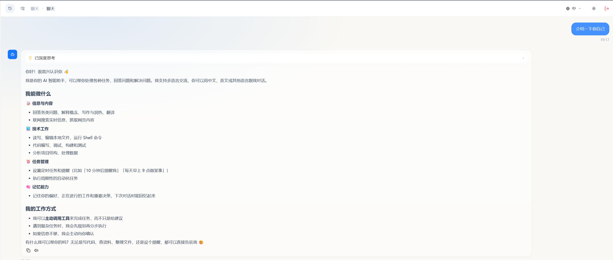

# GopherAgent

GopherAgent 是一个可自托管的个人 AI 智能体（Agent）。除了聊天，它还能**主动调用工具**完成任务：
联网搜索与抓取网页、读写和编辑本机文件、执行命令，并可设定**定时任务**按计划自动执行。
借助**长期记忆**，它能记住你的偏好与重要决定，在之后的对话中回忆起来。
支持接入任意 OpenAI 兼容的大模型（DeepSeek、OpenAI、通义、智谱、豆包等），
会话、模型与配置都可以在内置的网页控制台里管理。



---

## ✨ 已实现能力

| 模块 | 说明 |
| :--- | :--- |
| 配置管理 | 配置读写、API Key 脱敏，`GET/POST /config` |
| 模型供应商 | 多家 OpenAI 兼容供应商，管理凭证 / 自定义厂商 / 主模型 |
| 基础对话 | 多会话、系统提示词、上下文轮次裁剪 |
| Agent 工具 | function calling 循环：shell、文件读写编辑、网页抓取/搜索、记忆检索、定时任务 |
| 流式对话 | `POST /message` → `request_id`，`GET /stream` 以 SSE 推送 `reasoning / delta / tool_start / tool_end / done / stream_end`，支持 `after_seq` 断点续传 |
| 会话管理 | 列表 / 重命名 / 置顶 / 删除、历史分页、清空上下文、删除消息、会话级模型与权限 |
| 长期记忆 | Markdown 记忆文件（`MEMORY.md` + 每日记忆），向量 + 关键词混合检索 |
| 持久化 | GoFrame ORM + SQLite（`gopher_agent.db`）|

> 技能、知识库、通道、日志、工作空间等接口为占位实现，保证前端可正常加载，后续按需补齐。

## 🚀 快速开始

**后端**

```bash
go run main.go
# -> database: .../gopher_agent.db
# -> listening on :9899
curl http://localhost:9899/api/health
```

首次启动自动创建数据库与默认配置，无需 `config.json`；数据目录可用 `GOPHER_DATA_DIR` 指定（默认当前工作目录）。

**前端**

```bash
cd web && npm install
# web/.env.local
#   VITE_USE_MOCK=false
#   VITE_BACKEND_URL=http://localhost:9899
npm run dev     # http://localhost:5173
npm run build   # 产出 web/dist/
```

后端已开启 CORS，前端无需 Vite 代理。

## 🛠 Agent 工具

对话走工具调用循环：把工具定义（JSON Schema）随请求发给模型，模型返回 `tool_calls` 时在本地执行，
通过 SSE 推送 `tool_start` / `tool_end`，再把结果作为 `tool` 消息回传，直到模型给出最终回答（最多 `agent_max_steps` 步）。

| 工具 | 说明 |
| :--- | :--- |
| `bash` | 执行 shell 命令（Windows 用 PowerShell，其他平台 bash）|
| `read` / `write` / `edit` | 读取（支持行范围）/ 写入 / 精确字符串替换 |
| `ls` | 列出目录内容 |
| `web_fetch` | 抓取网页并转纯文本（拦截回环 / 内网地址）|
| `web_search` | 联网检索（bocha / zhipu / qianfan）|
| `memory_search` | 混合检索长期记忆与知识库（向量 + 关键词）|
| `memory_get` | 读取记忆 / 知识文件的行区间 |
| `scheduler` | 创建 / 管理定时任务（`once` / `interval` / `cron`）|

相关配置：`agent_workspace`、`agent_max_steps`（默认 30）、`disabled_tools`、
`agent_permission_mode`（当前仅记录，完整权限校验待实现）、`web_search_*`。

> ⚠️ 这些工具能读写本机文件、执行命令并联网，请仅在可信环境部署。

### 定时任务

`scheduler` 工具与后台 worker 共用 `scheduled_tasks` 表：

- 类型：`send_message`（到点写入会话）/ `agent_task`（到点由 Agent 执行并产出结果）
- 调度：`once`（`+10m` / ISO 时间）、`interval`（秒）、`cron`（5 字段）
- worker 每 10 秒扫描到期任务；`once` 任务执行后自动禁用

## 🧠 长期记忆

记忆存为工作区 Markdown，并在 SQLite 中建立可检索的块索引：

```
<workspace>/MEMORY.md            长期事实（每轮对话注入 system prompt）
<workspace>/memory/YYYY-MM-DD.md 每日记忆（按日期做时间衰减）
<workspace>/knowledge/**.md      知识库（knowledge 开启时）
```

- **切块 / 向量**：按行切块 `memory_chunk_tokens`(500) / `memory_chunk_overlap`(50)；OpenAI 兼容 `/embeddings`
- **索引**：`memory_chunks`（含 `embedding` BLOB）+ `memory_files`（文件 hash 增量），同步时按 hash 增量更新，embedding 失败保留旧索引
- **检索**：`score = vector_weight·向量余弦 + keyword_weight·关键词`，日期文件再乘时间衰减（半衰期 `memory_half_life_days` 天；`MEMORY.md` 不衰减）
- **写入**：Agent 用 `write`/`edit` 写记忆文件；开启 `memory_auto_flush` 时每累计 `memory_flush_turns` 轮自动把会话摘要追加到今日记忆
- **命令**：`/memory rebuild-index`（重建索引）、`/memory flush`（总结当前会话到今日记忆）
- **未配置 embedding**：检索自动降级为纯关键词模式，功能仍可用

## 🗂 目录结构

```
GopherAgent/
├── main.go                    # 入口（go run main.go）
├── internal/
│   ├── cmd/cmd.go             # 启动、路由注册、CORS
│   ├── store/sqlite.go        # SQLite 连接与建表
│   ├── controller/api/        # 控制台接口
│   └── logic/
│       ├── config/            # 配置存储 + 供应商注册表 + 凭证解析
│       ├── llm/               # OpenAI 兼容客户端（流式 + function calling + 摘要）
│       ├── embedding/         # 多厂商 OpenAI 兼容 embeddings
│       ├── tools/             # shell / 文件 / web / memory / scheduler
│       ├── memory/            # 文件记忆：切块、混合检索、时间衰减
│       ├── paths/             # agent 工作区解析
│       ├── scheduler/ + schedulerrun/   # 定时任务存储与后台 worker
│       └── chat/              # 会话/消息持久化、Agent 循环、SSE Hub
├── web/                       # 前端控制台（React + Vite + antd）
└── image/                     # README 效果图
```
